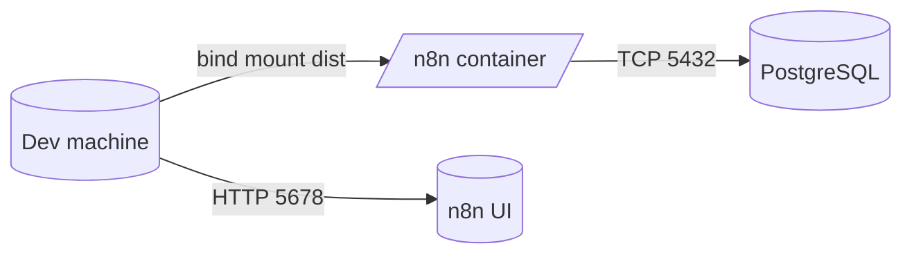
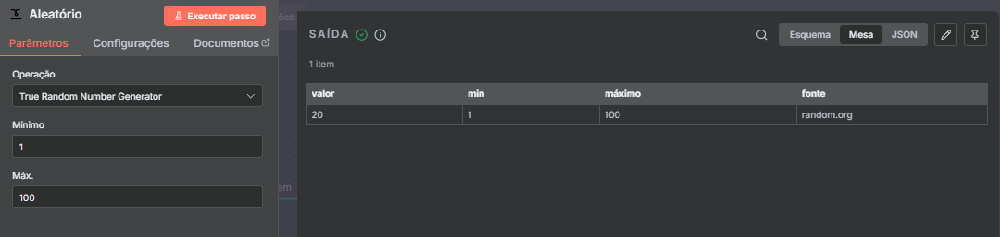
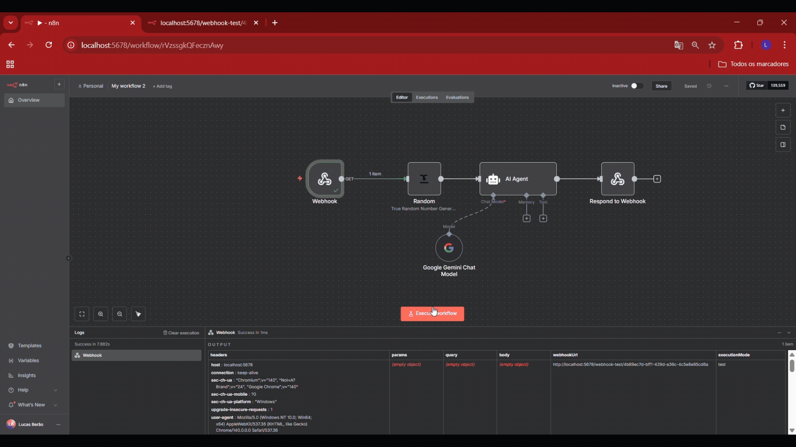

# n8n + Random Custom Node (Random.org)

Este repositório contém:
- Infra local do n8n via Docker Compose (com PostgreSQL)
- Um node customizado do n8n chamado `Random`, que consome o endpoint de inteiros do Random.org

Abaixo, o passo a passo completo — do zero até executar o node na UI do n8n.

## Sumário
- Pré‑requisitos
- Estrutura de pastas
- Variáveis de ambiente (.env)
- Subir a infra (Docker Compose)
- Build do node customizado
- Validar na UI do n8n
- Ciclo de desenvolvimento (hot reload simples)
- Troubleshooting
- Referências oficiais
- Convenções de branch e commits
- Apêndice: Comandos úteis

## Pré‑requisitos
- Docker e Docker Compose instalados
- Node.js 22 (LTS) ou superior e npm
- Porta 5678 livre na máquina local

## Estrutura de pastas
```
.
├─ docker-compose.yml                  # Infra do n8n + Postgres
├─ init-data.sh                        # Script p/ criar usuário não-root no Postgres
├─ n8n-random-node/                    # Projeto do node customizado (TypeScript)
│  ├─ src/nodes/Random/Random.node.ts  # Implementação do node
│  ├─ src/nodes/Random/random.svg      # Ícone do node
│  ├─ tsconfig.json
│  ├─ package.json
│  └─ dist/                            # Saída do build (montada no container)
└─ README.md                           # Este guia
```

Mermaid (arquitetura local):


## Variáveis de ambiente (.env)
Há um arquivo de exemplo `.env.example`. Para criar o seu `.env` na raiz, use o comando do seu sistema:

- Windows (PowerShell):
```powershell
Copy-Item .env.example .env
```

- Linux/macOS (Bash):
```bash
cp .env.example .env
```

Se preferir criar manualmente, utilize os valores abaixo (ajuste conforme preferir):
```env
POSTGRES_USER=postgres
POSTGRES_PASSWORD=postgres
POSTGRES_DB=n8n
POSTGRES_NON_ROOT_USER=n8n
POSTGRES_NON_ROOT_PASSWORD=n8n
```
O `docker-compose.yml` lê essas variáveis para configurar o Postgres e a conexão do n8n.

## Subir a infra (Docker Compose)
1) Suba os serviços em background:

- Windows (PowerShell):
```powershell
docker compose up -d
```

- Linux/macOS (Bash):
```bash
docker compose up -d
```

2) Verifique os logs do `n8n` (opcional):

- Windows (PowerShell):
```powershell
$n8nId = docker compose ps -q n8n
docker logs -f $n8nId
```

- Linux/macOS (Bash):
```bash
docker logs -f $(docker compose ps -q n8n)
```
3) A UI do n8n ficará disponível em:
- http://localhost:5678

### O que acontece automaticamente ao rodar `docker compose up -d`
- node_builder:
  - Executa `npm install` dentro de `n8n-random-node/` (apenas quando necessário).
  - Executa `npm run build` e gera `./n8n-random-node/dist` (JS + SVG).
  - Finaliza; o serviço `n8n` só inicia depois que ele termina com sucesso.
- postgres:
  - Inicializa o banco com as variáveis do `.env`.
  - Executa `init-data.sh` para criar o usuário não‑root.
  - Sinaliza “healthy” quando aceita conexões.
- n8n:
  - Só inicia após `postgres` estar healthy e `node_builder` concluir (depends_on).
  - Carrega nós privados de `/home/node/.n8n/custom` (bind mount de `./n8n-random-node/dist`).
  - Expoẽ a UI em http://localhost:5678.

Observação: em execuções subsequentes, o Docker pode reutilizar cache/volumes e o `node_builder` pode rodar rapidamente ou nem reconstruir se nada mudou em `n8n-random-node/`.

Observações relevantes no `docker-compose.yml`:
- Montagem do volume: `./n8n-random-node/dist:/home/node/.n8n/custom` — é assim que o n8n carrega nós privados.
- Variáveis definidas para boas práticas: `N8N_RUNNERS_ENABLED=true`, `N8N_ENFORCE_SETTINGS_FILE_PERMISSIONS=true`, `N8N_BLOCK_ENV_ACCESS_IN_NODE=false`.
- O Compose pode exibir um aviso sobre o atributo `version` ser obsoleto; é esperado e pode ser ignorado (ou remova a linha `version` do arquivo).

## Build do node customizado (opcional p/ desenvolvimento)
O projeto do node está em `n8n-random-node/` (TypeScript, estilo programático).

Na primeira subida com `docker compose up -d`, o serviço `node_builder` executa automaticamente `npm install` e `npm run build`, populando `dist/`. Use os comandos abaixo apenas para o ciclo de desenvolvimento local.

1) Instale dependências (primeira vez):
  - Windows (PowerShell):
  ```powershell
  cd n8n-random-node
  npm install
  ```
  - Linux/macOS (Bash):
  ```bash
  cd n8n-random-node
  npm install
  ```
2) Compile e gere a saída em `dist/` (inclui JS e SVG):
  - Windows (PowerShell):
  ```powershell
  npm run build
  ```
  - Linux/macOS (Bash):
  ```bash
  npm run build
  ```
A pasta `dist/` já está montada no container como `/home/node/.n8n/custom`, então o n8n verá o node após restart.

Alternativa via Docker (sem instalar Node localmente):
  - Windows (PowerShell):
  ```powershell
  docker compose run --rm node_builder
  ```
  - Linux/macOS (Bash):
  ```bash
  docker compose run --rm node_builder
  ```

3) Reinicie o n8n para recarregar nós privados:
  - Windows (PowerShell):
  ```powershell
  docker compose -f ../docker-compose.yml restart n8n
  ```

### O que permanece manual (sempre que necessário)
- Criar o `.env` (uma vez) a partir do `.env.example`.
- Abrir a UI do n8n no navegador: http://localhost:5678
- Ver logs quando necessário (PowerShell ou Bash, exemplos neste README).
- Durante o desenvolvimento do node:
  - Rodar `npm run build` (ou `docker compose run --rm node_builder`).
  - Reiniciar o serviço do n8n para recarregar nós privados.

### Primeira execução vs. próximas execuções
- Primeira execução:
  - Necessário criar `.env`.
  - `node_builder` fará `npm install` (mais demorado) e `npm run build`.
  - Postgres inicializa o banco e roda `init-data.sh`.
- Execuções subsequentes:
  - Normalmente mais rápidas (cache e volumes já existentes).
  - Só será preciso rebuild/restart do n8n se você alterar o código do node.
  - Linux/macOS (Bash):
  ```bash
  docker compose -f ../docker-compose.yml restart n8n
  ```

## Validar na UI do n8n
1) Abra http://localhost:5678
2) Crie um workflow e adicione o node `Random`
3) Operation: “True Random Number Generator”
4) Informe `Min` e `Max` (inteiros)
5) Execute o node e confira a saída `{ value, min, max, source: 'random.org' }`

## Ciclo de desenvolvimento
- Edite `n8n-random-node/src/nodes/Random/Random.node.ts`
- Rode `npm run build` (ou `docker compose run --rm node_builder`) para recompilar em `dist/`
- Reinicie o serviço do n8n:
  - Windows (PowerShell):
  ```powershell
  docker compose -f ../docker-compose.yml restart n8n
  ```
  - Linux/macOS (Bash):
  ```bash
  docker compose -f ../docker-compose.yml restart n8n
  ```
- Volte à UI e teste

Dica: deixe um terminal com logs do n8n para checar qualquer aviso/erro de carregamento de nós.
- Windows (PowerShell):
```powershell
$n8nId = docker compose ps -q n8n; docker logs -f $n8nId
```
- Linux/macOS (Bash):
```bash
docker logs -f $(docker compose ps -q n8n)
```

## Troubleshooting
- Porta 5678 ocupada: pare o processo que usa a porta ou ajuste o mapeamento em `docker-compose.yml`.
- n8n não enxerga o node:
  - Confirme os arquivos dentro do container:
    - Windows (PowerShell):
      ```powershell
      $n8nId = docker compose ps -q n8n
      docker exec -it $n8nId sh -lc "ls -la /home/node/.n8n/custom/nodes/Random"
      ```
    - Linux/macOS (Bash):
      ```bash
      docker exec -it $(docker compose ps -q n8n) sh -lc "ls -la /home/node/.n8n/custom/nodes/Random"
      ```
  - Garanta que o `npm run build` gerou `dist/nodes/Random/Random.node.js` e `random.svg`.
  - Reinicie o n8n após o build.
- Permissões de config do n8n: já habilitamos `N8N_ENFORCE_SETTINGS_FILE_PERMISSIONS=true` para manter seguro.
- Proxy/Firewall: a chamada ao Random.org é HTTPs; verifique saída de rede do container se houver bloqueios.

## Referências oficiais
- Programmatic style node (build): https://docs.n8n.io/integrations/creating-nodes/build/programmatic-style-node/
- Run a custom node locally (test): https://docs.n8n.io/integrations/creating-nodes/test/run-node-locally/
- Install private nodes (deploy): https://docs.n8n.io/integrations/creating-nodes/deploy/install-private-nodes/
- Random.org HTTP API (integers): https://www.random.org/clients/http/

## Convenções de branch e commits (sugestões)
- Branch (a partir de `main`): `feat/HDM-123-random-node`
- Commits (Conventional Commits + Jira key):
  - `HDM-123 feat(random): add programmatic Random node and icon`
  - `HDM-123 chore(dev): mount dist as custom nodes and restart n8n`

## Apêndice: Comandos úteis (Windows e Linux/macOS)
- Subir a infra:
  - PowerShell
    ```powershell
    docker compose up -d
    ```
  - Bash
    ```bash
    docker compose up -d
    ```
- Listar serviços:
  - PowerShell
    ```powershell
    docker compose ps
    ```
  - Bash
    ```bash
    docker compose ps
    ```
- Logs do n8n:
  - PowerShell
    ```powershell
    $n8nId = docker compose ps -q n8n; docker logs -f $n8nId
    ```
  - Bash
    ```bash
    docker logs -f $(docker compose ps -q n8n)
    ```
- Reiniciar n8n:
  - PowerShell
    ```powershell
    docker compose restart n8n
    ```
  - Bash
    ```bash
    docker compose restart n8n
    ```
- Build do node (local):
  - PowerShell
    ```powershell
    cd n8n-random-node; npm run build
    ```
  - Bash
    ```bash
    cd n8n-random-node && npm run build
    ```
- Build do node via serviço Docker:
  - PowerShell
    ```powershell
    docker compose run --rm node_builder
    ```
  - Bash
    ```bash
    docker compose run --rm node_builder
    ```
- Conferir arquivos do node no container:
  - PowerShell
    ```powershell
    $n8nId = docker compose ps -q n8n; docker exec -it $n8nId sh -lc "ls -la /home/node/.n8n/custom/nodes/Random"
    ```
  - Bash
    ```bash
    docker exec -it $(docker compose ps -q n8n) sh -lc "ls -la /home/node/.n8n/custom/nodes/Random"
    ```
## Aplicação prática: Demonstração com IA

Do desafio principal à aplicação prática
O objetivo central deste desafio foi criar um nó customizado do n8n que integrasse a API do Random.org. A infra com Docker, o ambiente do n8n e a implementação em TypeScript foram concluídos com sucesso. Para mostrar o valor real do conector, foi preparada uma demonstração que evidencia seu uso em um fluxo moderno com a IA do Google Gemini.

### Validação do nó principal (Random)
Para comprovar o funcionamento do conector, a imagem abaixo mostra a execução do nó no n8n. É possível visualizar os parâmetros Min/Max na entrada (Input) e o número aleatório gerado na saída (Output), validando a integração com o Random.org.



### Demonstração interativa com IA
A demonstração final é uma página web interativa que consome um webhook do n8n: ao clicar no botão, o fluxo é executado, um número aleatório é gerado pelo nó Random, enviado ao Gemini para criar uma frase e o resultado é exibido na própria página — sem recarregar.



### Como a demo foi construída (passo a passo)
1) Conexão inicial: validamos a integração entre o nó Random e o agente de IA (Google Gemini). Inicialmente, o resultado era visível apenas no painel do n8n.
2) Webhook como interface: substituímos o gatilho manual por um nó Webhook, transformando o fluxo em uma API acessível por URL.
3) Resposta HTML + CSS: configuramos o nó Responder ao Webhook para retornar uma página HTML estilizada (fundo escuro, tipografia maior) em vez de texto simples.
4) Interatividade via botão (JavaScript): criamos uma página index.html separada que usa fetch para chamar o webhook e atualizar o conteúdo dinamicamente, sem reload. Para isso, adicionamos o header CORS: Access-Control-Allow-Origin: * no nó Responder ao Webhook.
