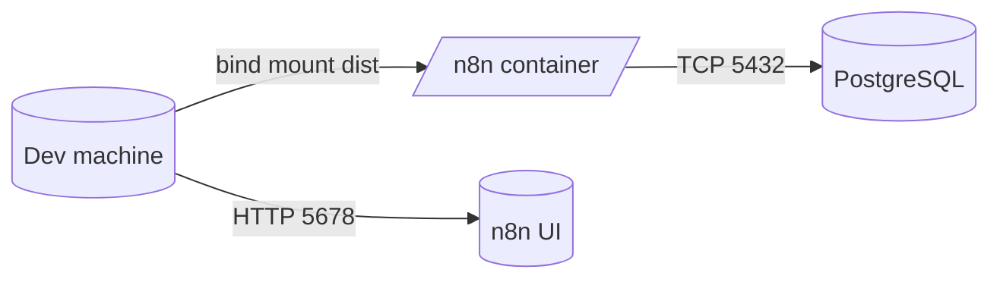

# n8n + Random Custom Node (Random.org)

Este repositório contém:
- Infra local do n8n via Docker Compose (com PostgreSQL)
- Um node customizado do n8n chamado `Random`, que consome o endpoint de inteiros do Random.org

Abaixo, o passo a passo completo — do zero até executar o node na UI do n8n.

## Sumário
- Pré‑requisitos
- Estrutura de pastas
- Variáveis de ambiente (.env)
- Subir a infra (Docker Compose)
- Build do node customizado
- Validar na UI do n8n
- Ciclo de desenvolvimento (hot reload simples)
- Troubleshooting
- Referências oficiais
- Convenções de branch e commits
- Apêndice: Comandos úteis

## Pré‑requisitos
- Docker e Docker Compose instalados
- Node.js 22 (LTS) ou superior e npm
- Porta 5678 livre na máquina local

## Estrutura de pastas
```
.
├─ docker-compose.yml                  # Infra do n8n + Postgres
├─ init-data.sh                        # Script p/ criar usuário não-root no Postgres
├─ n8n-random-node/                    # Projeto do node customizado (TypeScript)
│  ├─ src/nodes/Random/Random.node.ts  # Implementação do node
│  ├─ src/nodes/Random/random.svg      # Ícone do node
│  ├─ tsconfig.json
│  ├─ package.json
│  └─ dist/                            # Saída do build (montada no container)
└─ README.md                           # Este guia
```

Mermaid (arquitetura local):


## Variáveis de ambiente (.env)
Crie um arquivo `.env` na raiz com as variáveis abaixo (ajuste valores conforme preferir):
```env
POSTGRES_USER=postgres
POSTGRES_PASSWORD=postgres
POSTGRES_DB=n8n
POSTGRES_NON_ROOT_USER=n8n
POSTGRES_NON_ROOT_PASSWORD=n8n
```
O `docker-compose.yml` lê essas variáveis para configurar o Postgres e a conexão do n8n.

## Subir a infra (Docker Compose)
1) Suba os serviços em background:
```bash
docker compose up -d
```
2) Verifique os logs do `n8n` (opcional):
```bash
docker logs -f $(docker compose ps -q n8n)
```
3) A UI do n8n ficará disponível em:
- http://localhost:5678

Observações relevantes no `docker-compose.yml`:
- Montagem do volume: `./n8n-random-node/dist:/home/node/.n8n/custom` — é assim que o n8n carrega nós privados.
- Variáveis definidas para boas práticas: `N8N_RUNNERS_ENABLED=true`, `N8N_ENFORCE_SETTINGS_FILE_PERMISSIONS=true`, `N8N_BLOCK_ENV_ACCESS_IN_NODE=false`.
- O Compose pode exibir um aviso sobre o atributo `version` ser obsoleto; é esperado e pode ser ignorado (ou remova a linha `version` do arquivo).

## Build do node customizado (opcional p/ desenvolvimento)
O projeto do node está em `n8n-random-node/` (TypeScript, estilo programático).

Na primeira subida com `docker compose up -d`, o serviço `node_builder` executa automaticamente `npm install` e `npm run build`, populando `dist/`. Use os comandos abaixo apenas para o ciclo de desenvolvimento local.

1) Instale dependências (primeira vez):
```bash
cd n8n-random-node
npm install
```
2) Compile e gere a saída em `dist/` (inclui JS e SVG):
```bash
npm run build
```
A pasta `dist/` já está montada no container como `/home/node/.n8n/custom`, então o n8n verá o node após restart.

Alternativa via Docker (sem instalar Node localmente):
```bash
docker compose run --rm node_builder
```

3) Reinicie o n8n para recarregar nós privados:
```bash
docker compose -f ../docker-compose.yml restart n8n
```

## Validar na UI do n8n
1) Abra http://localhost:5678
2) Crie um workflow e adicione o node `Random`
3) Operation: “True Random Number Generator”
4) Informe `Min` e `Max` (inteiros)
5) Execute o node e confira a saída `{ value, min, max, source: 'random.org' }`

## Ciclo de desenvolvimento
- Edite `n8n-random-node/src/nodes/Random/Random.node.ts`
- Rode `npm run build` (ou `docker compose run --rm node_builder`) para recompilar em `dist/`
- Reinicie o serviço do n8n:
```bash
docker compose -f ../docker-compose.yml restart n8n
```
- Volte à UI e teste

Dica: deixe um terminal com `docker logs -f $(docker compose ps -q n8n)` para checar qualquer aviso/erro de carregamento de nós.

## Troubleshooting
- Porta 5678 ocupada: pare o processo que usa a porta ou ajuste o mapeamento em `docker-compose.yml`.
- n8n não enxerga o node:
  - Confirme os arquivos dentro do container:
    ```bash
    docker exec -it $(docker compose ps -q n8n) sh -lc "ls -la /home/node/.n8n/custom/nodes/Random"
    ```
  - Garanta que o `npm run build` gerou `dist/nodes/Random/Random.node.js` e `random.svg`.
  - Reinicie o n8n após o build.
- Permissões de config do n8n: já habilitamos `N8N_ENFORCE_SETTINGS_FILE_PERMISSIONS=true` para manter seguro.
- Proxy/Firewall: a chamada ao Random.org é HTTPs; verifique saída de rede do container se houver bloqueios.

## Referências oficiais
- Programmatic style node (build): https://docs.n8n.io/integrations/creating-nodes/build/programmatic-style-node/
- Run a custom node locally (test): https://docs.n8n.io/integrations/creating-nodes/test/run-node-locally/
- Install private nodes (deploy): https://docs.n8n.io/integrations/creating-nodes/deploy/install-private-nodes/
- Random.org HTTP API (integers): https://www.random.org/clients/http/

## Convenções de branch e commits (sugestões)
- Branch (a partir de `main`): `feat/HDM-123-random-node`
- Commits (Conventional Commits + Jira key):
  - `HDM-123 feat(random): add programmatic Random node and icon`
  - `HDM-123 chore(dev): mount dist as custom nodes and restart n8n`

## Apêndice: Comandos úteis
- Subir a infra:
```bash
docker compose up -d
```
- Listar serviços:
```bash
docker compose ps
```
- Logs do n8n:
```bash
docker logs -f $(docker compose ps -q n8n)
```
- Reiniciar n8n:
```bash
docker compose restart n8n
```
- Build do node:
```bash
cd n8n-random-node && npm run build
```
- Build do node via serviço Docker:
```bash
docker compose run --rm node_builder
```
- Conferir arquivos do node no container:
```bash
docker exec -it $(docker compose ps -q n8n) sh -lc "ls -la /home/node/.n8n/custom/nodes/Random"
```
