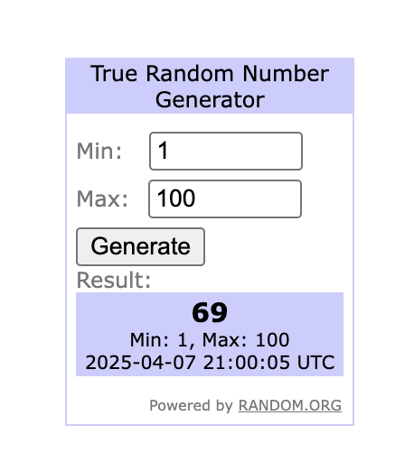

# **Desafio Técnico: Criação de Conector n8n Customizado**

## **1\. Visão Geral**

Como desenvolvedor, o seu desafio é criar um conector (custom node) para a plataforma de automação n8n. Um conector personalizado permite estender a capacidade da ferramenta, possibilitando uma experiência mais simplificada e poderosa para os usuários finais.

## **2\. O Desafio**

O objetivo é construir um conector do n8n chamado **Random** que recebe um input de um número inteiro mínimo e um máximo (ambos inclusos) para retornar um número aleatório, utilizando uma API externa de geração de números verdadeiramente aleatórios.

## **3\. Pré-requisitos Técnicos**

* **Node.js \+ TypeScript**: Versão 22 (LTS) ou superior.  
* **Docker e Docker Compose**: Para configurar e executar a instância do n8n e o banco de dados PostgreSQL de forma isolada.

## **4\. Requisitos Funcionais**

* O conector deve se chamar Random.  
* Deve possuir uma única operação: True Random Number Generator.  
* A operação deve ter dois campos de input:  
  * Min: Aceita apenas números.  
  * Max: Aceita apenas números.  
* O método execute do conector deve, obrigatoriamente, utilizar a API do **Random.org** para gerar os números. O endpoint a ser consumido via GET é:  
  * https://www.random.org/integers/?num=1\&min=1\&max=60\&col=1\&base=10\&format=plain\&rnd=new  
  * Os parâmetros min e max da URL devem ser preenchidos dinamicamente com os valores fornecidos pelo usuário no n8n.

## **5\. Requisitos Não-Funcionais**

* **Usabilidade**: Utilize nomes e descrições amigáveis e claras para os parâmetros criados.  
* **Identidade Visual**: Adicione um ícone em formato SVG para o conector, de forma que ele seja facilmente identificável na interface do n8n.

## **6\. Exemplo de Interface Final**

A interface do conector dentro do n8n deve ser similar à imagem abaixo, apresentando os campos para Min e Max.

## **7\. Etapas de Desenvolvimento e Recursos**

Para completar este desafio, utilize a documentação oficial do n8n como guia principal.

#### **7.1. Configuração da Infraestrutura**

A base do seu ambiente de desenvolvimento será uma instância n8n self-hosted rodando com Docker. Siga o guia oficial para a instalação.

* **Recurso**: [n8n instalado com Docker (self-hosted)](https://docs.n8n.io/hosting/installation/docker/)

#### **7.2. Desenvolvimento do Conector**

Para a criação do conector, siga a abordagem programática, que oferece maior flexibilidade e controle.

* **Recurso**: [Desenvolvimento Programático de um Custom Node](https://docs.n8n.io/integrations/creating-nodes/build/programmatic-style-node/)

#### **7.3. Teste e Validação**

Após a codificação, é crucial testar seu conector em um ambiente real para garantir que ele funcione como esperado.

* **Recurso**: [Instalar e Rodar um Custom Node Localmente](https://docs.n8n.io/integrations/creating-nodes/test/run-node-locally/)

## **8\. Critérios de Avaliação**

* **Infraestrutura**: Configuração da infra do n8n local, considerando a utilização de Docker Compose e banco PostgreSQL.  
* **Estrutura**: Configuração correta da pasta interna de conectores personalizados (.n8n/custom).  
* **Organização**: Organização de arquivos do conector personalizado.  
* **Código**: Qualidade e limpeza do código para implementar o custom node.  
* **Integração**: Qualidade da integração com a API do Random.org.  
* **Atenção aos Detalhes**: Qualidade e atenção aos detalhes na criação do conector (ícone, descrições, etc.).  
* **Documentação**: Qualidade e detalhamento do README.md para instalar e rodar o projeto.  
* **Boas Práticas**: Utilização das melhores práticas, conforme documentação oficial do n8n.

**Boa sorte no desafio\!**